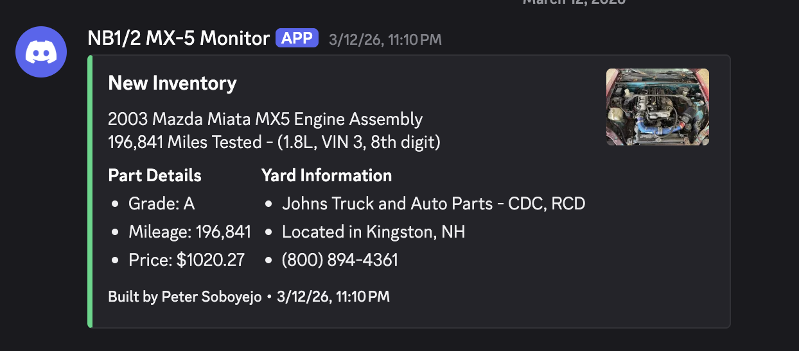

# car-part-monitor

Notification system for monitoring local junkyards utilizing car-part.com's inventory system.



## Features

* **Automated Scraping:** Continuously polls for new inventory matches without the need for manual searching.
* **Real-time Notifications:** Integrated Discord webhook support to receive instant alerts on your desktop or mobile device.
* **Persistent Tracking:** Utilizes a lightweight SQLite for portability.
* **Customizable Search Profiles:** Support for multiple monitors, allowing enabling tracking of different makes, models, or specific parts simultaneously.

### Installation

car-part-monitor requires the following
- [Node.js (LTS Version)](http://nodejs.org/)

Setup:

```sh
git clone https://github.com/dzt/car-part-monitor.git
cd car-part-monitor
npm install
```

After installing dependencies, ensure to modify the `config.example.json` and `monitors.example.json` file accordingly to suite your needs. After modifying the following files rename the two files to `config.json` and `monitors.json`.

Run After Setup:

```sh
npm run add
npm start
```

## License

```
The MIT License (MIT)

Copyright (c) 2026 Peter Soboyejo <http://petersoboyejo.com/>

Permission is hereby granted, free of charge, to any person obtaining a copy of this software and associated documentation files (the "Software"), to deal in the Software without restriction, including without limitation the rights to use, copy, modify, merge, publish, distribute, sublicense, and/or sell copies of the Software, and to permit persons to whom the Software is furnished to do so, subject to the following conditions:

The above copyright notice and this permission notice shall be included in all copies or substantial portions of the Software.

THE SOFTWARE IS PROVIDED "AS IS", WITHOUT WARRANTY OF ANY KIND, EXPRESS OR IMPLIED, INCLUDING BUT NOT LIMITED TO THE WARRANTIES OF MERCHANTABILITY, FITNESS FOR A PARTICULAR PURPOSE AND NONINFRINGEMENT. IN NO EVENT SHALL THE AUTHORS OR COPYRIGHT HOLDERS BE LIABLE FOR ANY CLAIM, DAMAGES OR OTHER LIABILITY, WHETHER IN AN ACTION OF CONTRACT, TORT OR OTHERWISE, ARISING FROM, OUT OF OR IN CONNECTION WITH THE SOFTWARE OR THE USE OR OTHER DEALINGS IN THE SOFTWARE.
```